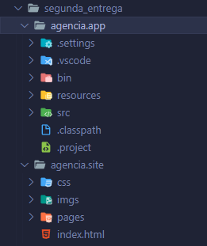
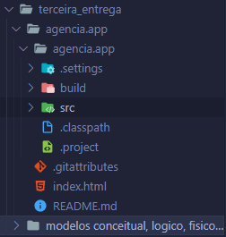

# Minha jornada na recode

Este repository contem os projetos e entregas feitas por mim durante toda jornada no curso da Recode.

Em 2022, no primero semestre do ano, tomei a decisão de entrar de vez na área da TI, logo em fevereiro comecei minha faculdade de Análise e desenvolvimento de sistemas, fiquei bem empolgado e comecei a pesquisar muito sobre tecnologia na internet, procurando vagas pra estágios, vagas pra bootcamps e outro, até encontrar a Recode, que estava com vagas abertas pro programa Recode Pro, logo me inscrevi e fiz tudo que tinha que fazer pro processo seletivo, consegui passar pra segunda etapa que consistia em um final de semana de hackathon, foi muito divertido, conheci muita gente e aprendi muito tanto com os mentores quanto com os colegas de squad, logo depois do hackathon, consegui ser chamado pra de fato participar do programa Recode Pro.

E aqui nesse repositório, deixou documentado minha evolução dentro do curso, dos primeiros projetos em pseudocódigo até os projetos maiores feitos em java e mysql, aplicando mvc e crud.

## Primeira entrega

Minha primeira entrega foi separado em front-end e back-end, pra front-end foi pedido um site simples utilizando apenas html, css e bootstrap, na época, nem utilizava muito javascript, ainda teria aulas de javascript pela frente. Já pra back-end, utilizamos pseudocódigo e fizemos um sistema simples pra uma agência de viagens, lembro de ter ficado bem empolgado e consegui fazer a parte do back-end em um final de semana.

segue imagem de como ficou o site:

## Segunda entrega

Já na segunda entrega, a coisa começou a ficar mais complexa, tive que refazer o back-end que havia feito em pseudocódigo, agora utilizando oque aprendi em java e para o front-end apenas tive que refatorar o site.

imagem dos arquivos da segunda entrega:

## Terceira entrega

Esta foi a entrega que mais tive que me empenhar em aprender coisas novas e aplicar, aplicamos crud utilizando Java e MySQL, e dessa vez o site teria que de fato funcionar, tive que juntar o front-end e back-end, foi mais difícil, tive que lidar com vários erros novos e problemas, mas aprendi demais.

imagem dos arquivos da terceira entrega:
